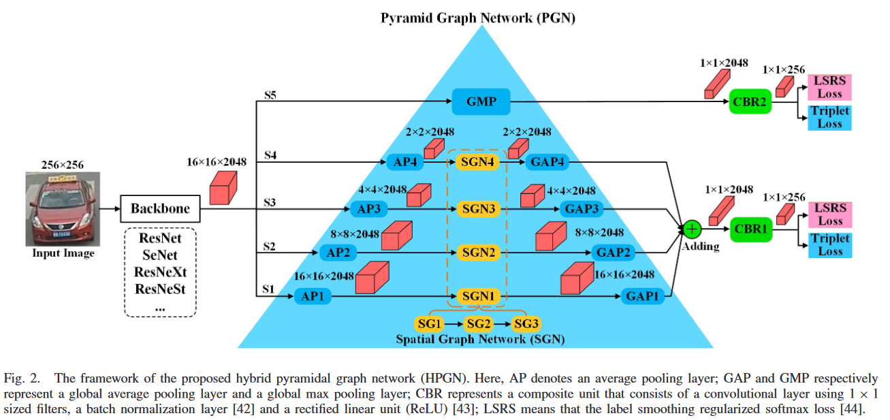

# HPGN
 [Exploring spatial significance via hybrid pyramidal graph network for vehicle re-identification](https://ieeexplore.ieee.org/stamp/stamp.jsp?tp=&arnumber=9457192)




## Training
```
python3 main.py  --mode train
```


## Testing
```
python3 main.py  --mode evaluate
```

## Citation

If you find this code useful for your research, please cite our paper
```
@article{shen2021exploring,
  title={Exploring spatial significance via hybrid pyramidal graph network for vehicle re-identification},
  author={Shen, Fei and Zhu, Jianqing and Zhu, Xiaobin and Xie, Yi and Huang, Jingchang},
  journal={IEEE Transactions on Intelligent Transportation Systems},
  year={2021},
  publisher={IEEE}
}
```
